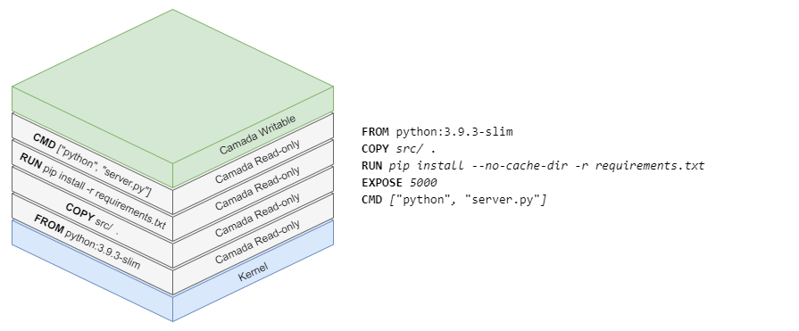
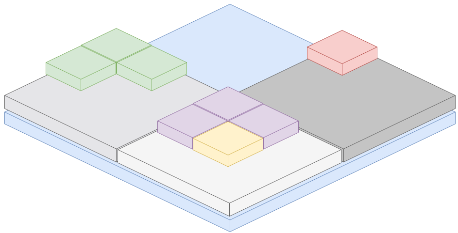
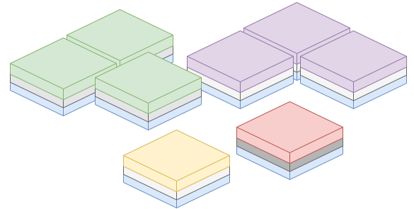

    

 

## O que é docker ?

Docker é uma plataforma de desenvolvimento e entrega de software usando containeres. Ele oferece a vantagem de que a aplicação irá se comportar da mesma forma independente do ambiente onde essa aplicação esteja rodando.

 

## O que é container ?

Container é um processo, que é executado isolado dos outros dentro da máquina hospedeira. Esse isolamento tem algumas features como *[kernel namespaces e cgroups](https://medium.com/@saschagrunert/demystifying-containers-part-i-kernel-space-2c53d6979504)* , essas features já existem dentro do Linux a um bom tempo, o principal papel do docker foi facilitar a utilização delas independete do kernel do host.

 

## Camadas

    

Camadas são imagens parciais criadas por cada comando dentro do dockerfile (eg. RUN, COPY, ADD, etc), o conjunto de imagens formam a imagem final construída pelo dockerfile. Essas camadas são muito importantes para a otimização da utilização de recursos pela parte do docker e são o que torna possível uma das maiores vantagens do docker dentro do ambiente produtivo, se dois containeres utilizarem a mesma camada ela não será duplicada, ambos os containers irão compartilhar a mesma camada, isso faz com que aplicações em ambiete **PaaS** utilizem de forma mais eficiente os recursos quando comparadas com a mesma plataforma em ambiente **IaaS**.

Uma caracteristica das camadas de uma imagem docker é que todas elas, exceto a ultima camada, que é criada em tempo de execução do container, são *Read-Only*, o que faz com que todas as camadas sejam imutáveis, que é o que torna possível que elas sejam compartilhadas entre containers diferentes. A ultima camada é também a unica camada que não é *Read-Only*, ela é a camada de aplicação, é a camada onde a aplicação de fato altera os arquivos e é executada, um detalhe importante sobre essa camada é que mesmo nela, a edição de arquivos deve ser feita com certo cuidado, já que caso ela altere um arquivo que foi copiado anteriormente, para respeitar a imutabilidade esse arquivo será copiado e a cópia que será editada, ou seja, isso fará com que a imagem em execução se torne mais pesada (e também pode se tornar um memory leak da aplicação se esse arquivo for aberto e fechado e editado mais de uma vez) e essas alterações não serão carregadas entre as réplicas, em casos onde é necessário ter **io** de arquivos o ideal é se utilizar um *volume persistente*.

    
    VS
    

 

*[Rodando os exemplos - SEM SOM](https://youtu.be/bCojDwskknQ)*

## Referencias

*[Docker Docs](https://docs.docker.com/)*

*[Docker Volumes](https://docs.docker.com/storage/volumes/)*

*[Kernel namespaces e cgroups](https://medium.com/@saschagrunert/demystifying-containers-part-i-kernel-space-2c53d6979504)*

*[Desenvolvendo detro de um container usando um volume](https://code.visualstudio.com/docs/remote/containers)*

*[Customizando a extensão Docker do vscode](https://code.visualstudio.com/docs/containers/reference#_docker-run-task)*

*[Customizando o docker-run task](https://code.visualstudio.com/docs/containers/reference#_python-object-properties-dockerrun-task)*

*[Como debugar algo com vscode e Docker](https://code.visualstudio.com/docs/containers/debug-common)*
